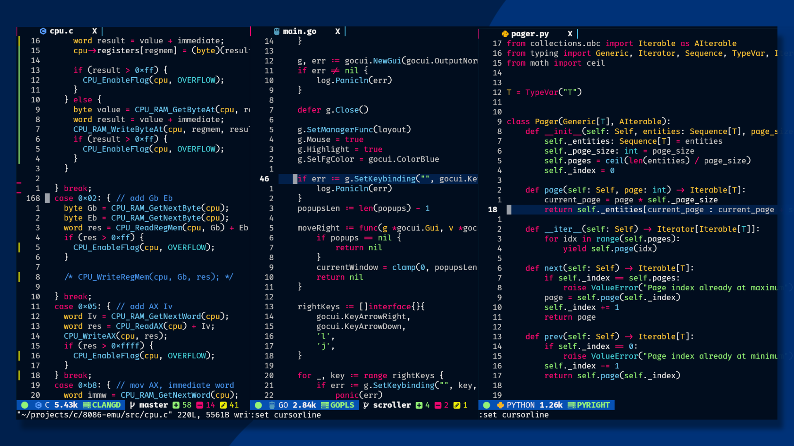

# CityScape 🌆

> NOTE: This a work in progress, not all highlight groups have been defined, please
> report anything that's missing.



City Scape is a colorscheme inspired by the neon signs on big cities, that's pretty
much it lmao.


## Features

> CityScape currently lacks a lot of features that more robust colorschemes have, like
> plugin integrations... etc. Those will come as I deem necessary or as people request.

### Plugin Integrations

- [nvim-cmp](https://github.com/hrsh7th/nvim-cmp)
- [treesitter](https://github.com/nvim-treesitter/nvim-treesitter) (WIP)


## Installation

Install with your favorite plugin manager

- Packer

```lua
use "zSnails/cityscape.nvim"
```

- VimPlug

```vim
Plug 'zSnails/cityscape.nvim'
```
